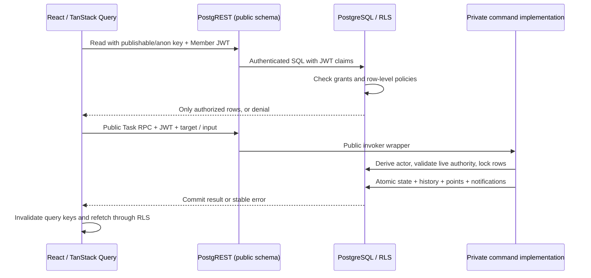
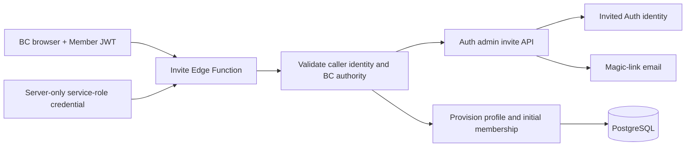
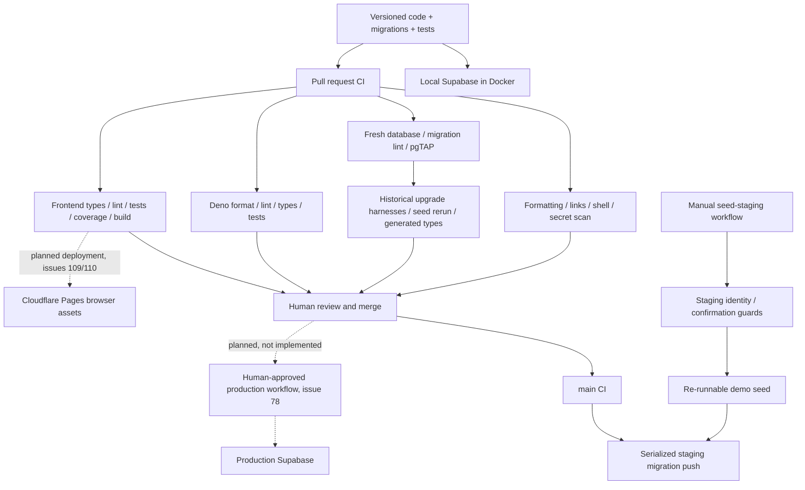

# Browser-to-production data flow

Version 1, 2026-09-19. This is a map of the current code and its trust boundaries, not a second product specification. [ADR-0001](adr/0001-supabase-postgres-rls.md), [ADR-0002](adr/0002-frontend-browser-pwa.md), [ADR-0003](adr/0003-invite-only-auth.md), and [the domain glossary](../CONTEXT.md) own their respective decisions. Tracker, Calendar, and Groups behavior follows ADR-0007–0009 in the [ADR index](adr/README.md).

## Sign-in and membership

The browser is untrusted. Navigation guards help a Member find the right screen; they cannot authorize a database request. Supabase Auth authenticates the invited identity, while the access-token hook supplies organization claims only for an active profile. A signed-in identity without those claims reaches `/no-profile` and cannot read organization data.

```mermaid
sequenceDiagram
    actor Member
    participant Browser as Browser (untrusted)
    participant Auth as Supabase Auth
    participant Hook as PostgreSQL access-token hook
    Member->>Browser: Request magic link for invited email
    Browser->>Auth: Request email link (no public sign-up)
    Auth-->>Member: Email magic link
    Member->>Auth: Follow one-time link
    Auth->>Hook: Build token for authenticated identity
    Hook->>Hook: Read active profile and memberships
    Hook-->>Auth: Organization claims, or no membership claims
    Auth-->>Browser: Session / signed JWT at allowed callback
    Browser->>Browser: Decode claims once; route to app or /no-profile
```

The token is a signed snapshot, not a live roster. The accepted read-access window after deactivation is bounded by its lifetime; sensitive commands additionally check the live actor. See [ADR-0003](adr/0003-invite-only-auth.md) and [auth configuration](backend/auth-config.md) for the exact guarantees and session-revocation requirement. Groups Wave 1 adds membership claims but does not itself replace every legacy authority helper.

## Ordinary reads and atomic commands



Only `public` is exposed through the Data API; `private` holds implementation functions and authority helpers with restricted execute grants. A security-definer function is an explicit privilege boundary, so it must validate authority and pin an empty search path. Browser code never writes Task tables directly. [Backend conventions](backend/conventions.md) define wrappers, locks, grants, error vocabulary, and tests. Realtime, when used, only tells the browser to refetch; its payload never creates a second authorization path.

## Privileged invitation flow



The Edge Function validates the caller before using its admin credential. That credential bypasses ordinary RLS and must never reach the browser. Auth invitation and profile provisioning cross separate APIs; failure handling is part of the [invitation implementation](backend/inviting.md), not a promise of a distributed database transaction. Bulk imports use the same validated invitation path.

## Local, staging, and production



Local Docker runs the disposable Supabase stack, including PostgreSQL, Auth, and PostgREST. Migrations are the only schema-write path: create a migration, reset locally, and run the database suite. Never edit schema through Studio. The [CI workflow](../.github/workflows/ci.yml) is the executable definition of checks, including seed re-runnability and generated-type drift; [the local CI runner](../scripts/check-local-ci.sh) mirrors its available local gates and states its exceptions.

A PR never deploys to staging. Only a push to `main` runs the serialized staging migration job, and it explicitly skips when staging secrets are absent. Migration push does not apply `seed.sql`: the separate [manual staging seed workflow](../.github/workflows/seed-staging.yml) owns demo data, as explained in [the staging seed guide](backend/seeding-staging.md). Production deployment and Cloudflare setup remain tracked work, not capabilities this diagram claims already exist. Production must not receive the demo seed; ADR-0005 in the [ADR index](adr/README.md) defines the rollout order.

## Credential boundaries

| Location               | Material                                                    | Boundary                                                                 |
| ---------------------- | ----------------------------------------------------------- | ------------------------------------------------------------------------ |
| Browser build          | Supabase URL and publishable/anon key                       | Public configuration; grants, JWT verification, and RLS protect data.    |
| Member session         | Access and refresh tokens                                   | Credentials for that Member; never commit or place in screenshots/logs.  |
| Edge Function runtime  | Auth admin/service-role credential                          | Server-only; validated privileged operations, never sent to the browser. |
| GitHub Actions secrets | Supabase access token, database password, project reference | Used by deployment/seed jobs; not frontend build variables.              |
| Human password manager | Operational credentials                                     | Bitwarden; real-terminal/dashboard setup by authorized humans.           |
| Local environment      | Disposable stack keys and local app configuration           | Development only; keep private environment files out of git.             |

A frontend guard, hidden button, or secret-looking project URL is not a security boundary. The relevant boundaries are verified identity, organization claims, live command authority, SQL grants/RLS, privileged server credentials, and human-controlled deployment.
