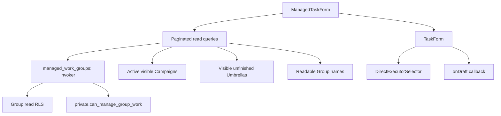

# Task draft form evidence

The form separates two ideas that looked alike (review on #554, decided with Alex on 2026-09-22):

- **Task-umbrelă** is a kind of Task: a parent that groups Subtasks. The first question of the form, `Ce fel de task?`, offers Task, Task-umbrelă and Subtask with a one-line explanation each. A Subtask picks its parent from the chosen Group's open Umbrellas; choosing a parent also sets the Group.
- **Campanie** is an optional reporting label at the end of the form: it shows the points earned and who worked on it, and never changes who may work on the Task. Only the chosen Group's and its ancestors' active Campaigns are offered.

The Origin is picked from a searchable Group dropdown in tree order; a Child Group shows its parent (`Echipa afișe · Conferință`), using readable Group names even when the parent itself is not managed. The Executor is the searchable member dropdown from #183.

The 2026-09-19 screenshots showed the previous native selects and were removed. Component tests cover the flows above, including axe accessibility checks and read failure/retry states. No Task command or database write is called by this form.

`managed_work_groups()` delegates authority to the shared live Group helper and preserves its BC/Moderator override for archived Groups. It exposes only id, name, path, and Minimum Level. The form uses those paths for nesting and ancestor Campaign choices; it does not infer Group authority from member roles.

The form deliberately ends at `onDraft`. Strict shared domain validation and safe server-error mapping belong to #182; create-command submission belongs to #184.

Validation: the new RPC suite fails against the parent schema (missing function), then passes all 14 assertions after the migration. The complete database run passes 104 suites / 4,151 assertions, with strict lint, historical upgrade harnesses, seed repeatability, exact generated types, and the public-command smoke test. The full frontend suite passes 53 files / 298 tests; the final focused form/query run passes 10 tests, including axe.
