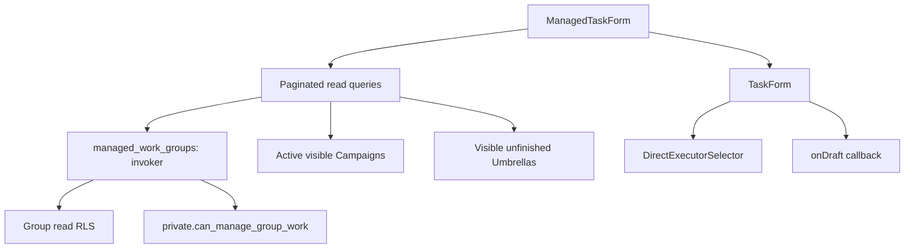

# Task draft form evidence

Captured 2026-09-19 in Chromium using the real `TaskForm` and `DirectExecutorSelector`, with fixture form options and cached Executor query data. Desktop: 1440 × 1000; mobile: 390 × 844. No Task command or database write is called by this form.

- `direct-desktop.png` / `direct-mobile.png`: a third-level Group, an ancestor-owned Campaign, Bucharest deadline, and selected Executor.
- `subtask-mobile.png`: a public Subtask with its Origin locked to the selected Umbrella.
- `umbrella-mobile.png`: an Umbrella without Audience, Assignment Mode, Campaign, or Executor controls.

The browser capture verifies the Subtask Origin is disabled and submitting an Umbrella invokes the draft callback. Fixtures demonstrate frontend behavior; database authority is tested separately in `managed_work_groups.test.sql`. Component tests include axe accessibility checks and read failure/retry states.

`managed_work_groups()` delegates authority to the shared live Group helper and preserves its BC/Moderator override for archived Groups. It exposes only id, name, path, and Minimum Level. The form uses those paths for nesting and ancestor Campaign choices; it does not infer Group authority from member roles.

The form deliberately ends at `onDraft`. Strict shared domain validation and safe server-error mapping belong to #182; create-command submission belongs to #184.

Validation: the new RPC suite fails against the parent schema (missing function), then passes all 14 assertions after the migration. The complete database run passes 104 suites / 4,151 assertions, with strict lint, historical upgrade harnesses, seed repeatability, exact generated types, and the public-command smoke test. The full frontend suite passes 53 files / 298 tests; the final focused form/query run passes 10 tests, including axe.
