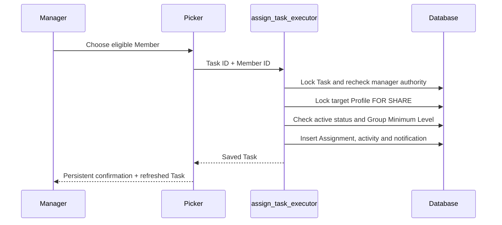

# Direct assignment (#350)

When a direct Task has no Executor, its manager can now pick someone and press **Atribuie**. The picker shows active Members who meet the Origin Group's Minimum Level, while the server checks that rule again before saving. A successful assignment keeps its confirmation visible when the Task refreshes, and a later give-up allows another assignment. Errors use safe Romanian messages and refresh the Task so stale information does not linger.

## Screenshot evidence

These screenshots render the production assignment control and executor selector in a small review fixture, with the real application theme and synthetic query data. The assignment RPC is intercepted; these images demonstrate the UI and the refetch-before-response confirmation behavior, not a live database transaction. Database command behavior is covered separately by pgTAP and concurrency tests.

- [Desktop](assignment-desktop.png)
- [Mobile](assignment-mobile.png)
- [Mobile confirmation](assignment-success-mobile.png)

## Regression coverage

The new minimum-level test fails six of seven assertions against the parent schema: a below-minimum Member is incorrectly assigned and produces activity and a notification. The fix preserves existing state-conflict precedence and accepts a Member exactly at the minimum even without membership in the Origin Group. The existing direct-assignment concurrency suite also verifies that target deactivation waits for the assignment's Profile lock.

The server change is scoped to `assign_task_executor`; creation and other assignment commands are not changed by this PR. Public signatures and grants remain unchanged.

Validation: all 104 database suites / 4,148 assertions, strict lint, historical migration harnesses, seed repeatability, generated types and public-command smoke passed. Removing the target `FOR SHARE` lock makes two concurrency assertions fail; restoring it passes all 68 focused database assertions.
