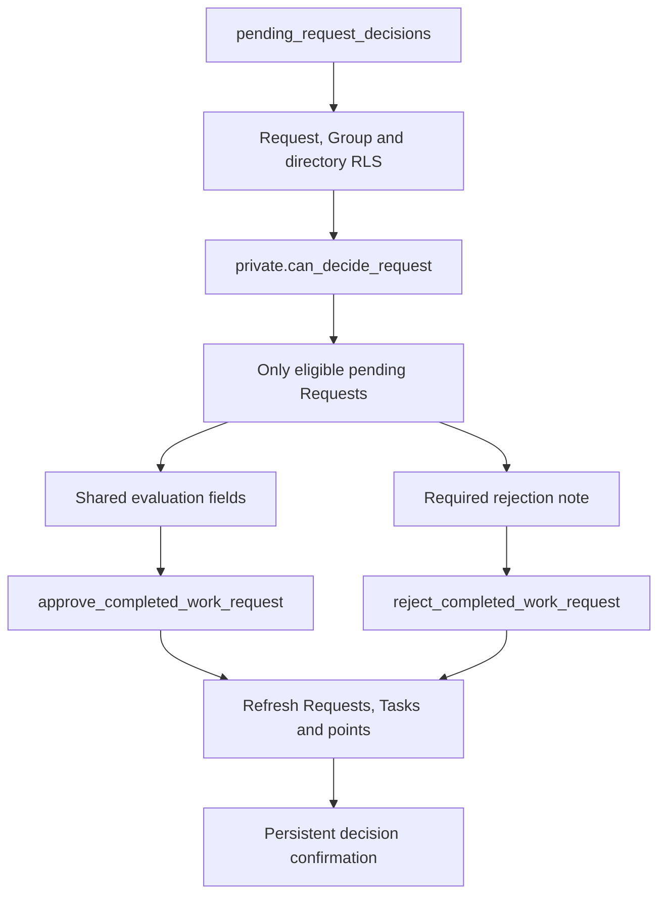

# Completed-work Request decisions (#353)

Managers now see a queue of pending Requests they are allowed to decide. Approval reuses the Task evaluation form, so Difficulty, Rating and a note are required before the existing approval command records the work and points. Rejection requires a note and calls the existing rejection command. The server supplies the decision queue using live Group authority, and success feedback stays visible when the decided Request disappears from the refreshed list.

## UI evidence

[Approval desktop](approval-desktop.png) · [Approval mobile](approval-mobile.png) · [Rejection mobile](rejection-mobile.png)

The screenshots use the production queue and shared evaluation fields, with the application theme and synthetic cached Request/scoring-guide data. They demonstrate the input flows, not a live approval transaction. Query/component tests cover command payloads, mandatory inputs, safe errors, duplicate-submit protection and confirmation surviving an empty queue refetch; database tests cover live queue authority.

The read endpoint is necessary because Request visibility is broader than decision permission: seeing a Request must not imply permission to approve it. It is security-invoker, retains RLS, excludes self-decisions through the established authority helper, and adds no write path. The client pages all queue rows in creation-time/ID order and refuses partial results on a failed page.
