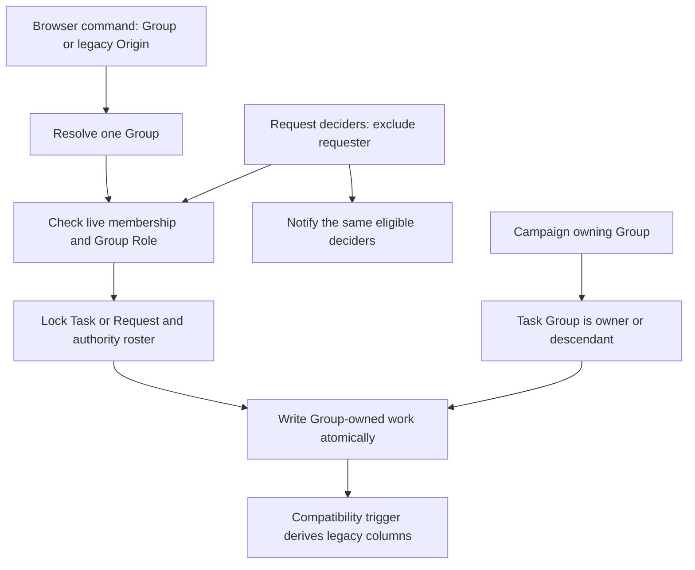

# Group commands (#522)

Tasks and Completed-work Requests now name their owning Group directly. Managers can create Campaigns for Projects and Teams, and a Campaign can label work anywhere below its Group. A Request goes to the people allowed to decide it, and nobody can decide their own Request. Older screens keep working through the existing argument names while they move to Groups.

The issue's old self-including examples contradicted its explicit “never the requester” rule. The implementation follows the accepted plan's matrix: ordinary requesters admit Group Managers, Group Responsibles and BC/Moderator; Responsible requesters admit Group Managers and BC/Moderator; Manager requesters admit other Group Managers and BC/Moderator. The requester is removed in every case, including BC/Moderator.

Wave 2 still rejects Tasks and Requests on Groups that have no legacy Origin mapping. This preserves #519's compatibility boundary until Wave 3. Campaigns can already belong to any Group.

Verification covers legacy and Group argument compatibility, decider/notification sets, self-decision refusals, inherited Campaign ownership, Group-only trigger checks, and concurrent Campaign/Request decisions against roster revocation. Existing double-approval and Campaign duplicate-creation races remain covered. The Group lock probe permits the compatible foreign-key Key Share lock taken by a Campaign insert, while rejecting an authority Share lock that would block mirror updates.
