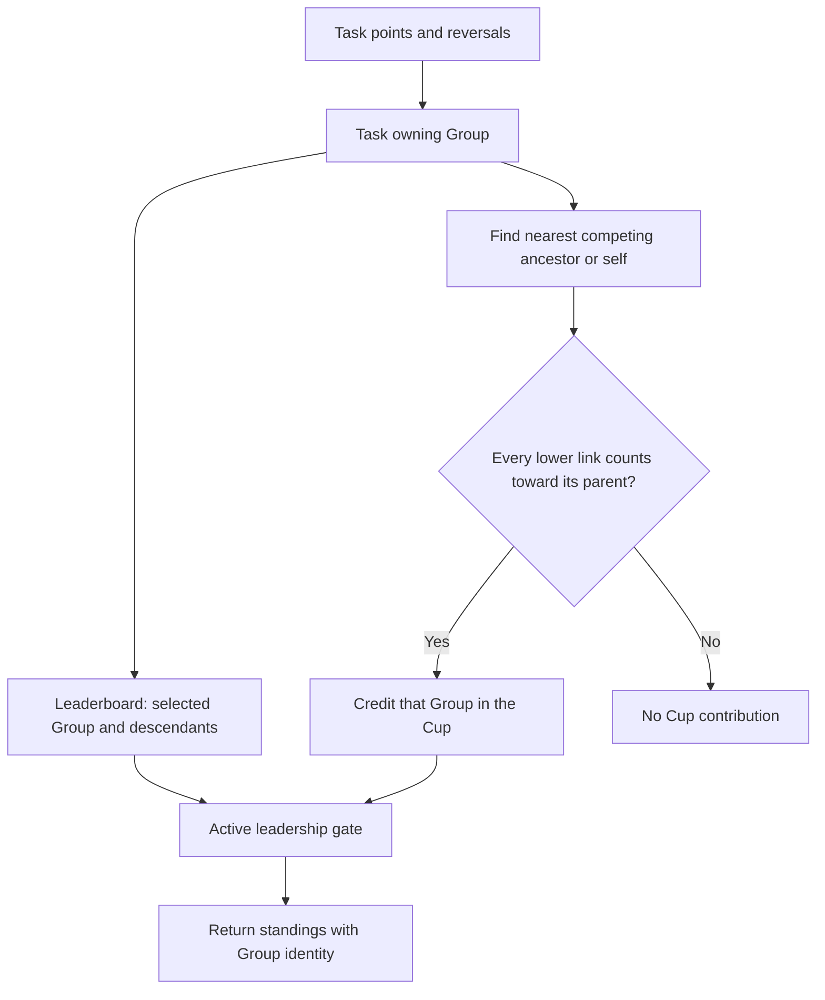

# Group leadership metrics (#523)

Leadership can filter the Leaderboard by one Group and all of its subgroups. Department Cup points follow the Group tree and count only when every link to the competing Group permits them. The Cup keeps its existing Dashboard columns and adds the Group identifier, while member history adds the Group name too. Leadership access stays restricted to active BCE, BC and Moderator members.

Campaign filters apply to the Task that earned the points. Sanctions stay out of both metrics, reversals subtract from the original award, and inactive earners keep their historical Leaderboard rows. Cup membership counts only active explicit members of the competing Group itself.

Tests place two native intermediate Groups above a mapped Task Group. This proves that both links independently control attribution while preserving Wave 2's requirement that Task Origins still map to legacy structures. Group Category is only presentation: the tests also enable competition for a Project Group and verify that its points appear.
